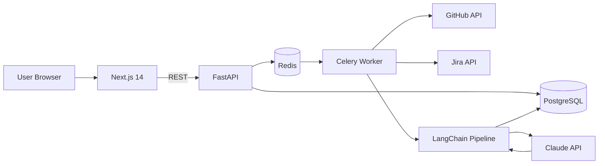

# DevMetrics AI


**AI-powered engineering productivity platform** that connects to GitHub and Jira, runs a multi-step LangChain pipeline against Claude, and produces multi-dimensional developer scorecards with actionable recommendations — all surfaced in a dark, glassmorphic dashboard.

---

## Architecture



---

## Features

- **Multi-dimensional scoring** — quality, impact, velocity, collaboration, reliability, growth tracked per developer
- **LangChain AI pipeline** — commits and tickets processed through a structured agent chain powered by Claude
- **Real-time dashboard** — dark glassmorphic UI with animated charts (Recharts + Framer Motion)
- **Team manager view** — compare all developers side-by-side with trend analysis
- **Integration hub** — connect GitHub repos and Jira projects through the in-app UI
- **Cost-controlled** — AI analysis is manual-only; no background spend without confirmation

---

## Quick Start

```bash
# 1. Start infrastructure
docker compose -f backend/docker-compose.yml up -d

# 2. Create and activate Python venv, install dependencies
cd backend && python -m venv venv && source venv/bin/activate && pip install -r requirements.txt && cd ..

# 3. Configure environment, migrate, seed
cp backend/.env.example backend/.env   # fill in DATABASE_URL + ANTHROPIC_API_KEY
cd backend && alembic upgrade head && python seed_data.py && cd ..

# 4. Install frontend dependencies
cd frontend && npm install && cd ..

# 5. Launch everything
bash start.sh
```

Open **http://localhost:3000** — the dark marketing landing page loads immediately.

---

## Demo Credentials

| Role | Email | Password |
|---|---|---|
| Manager | `manager@devmetrics.ai` | `Manager123!` |
| Developer 1 | `dev1@devmetrics.ai` | `Dev123!` |
| Developer 2 | `dev2@devmetrics.ai` | `Dev123!` |

---

## Tech Stack

| Layer | Technologies |
|---|---|
| Frontend | Next.js 14, TypeScript, TailwindCSS, Framer Motion, Recharts, Zustand |
| Backend | FastAPI, SQLAlchemy, Alembic, Celery, Redis |
| AI | LangChain, Claude API (Anthropic) |
| Data | PostgreSQL, Redis |
| Integrations | GitHub REST API, Jira REST API |

---

> **Private project — not open source. All rights reserved.**
> Built as a portfolio demonstration. Not for redistribution or commercial use without permission.
>
> Built by **Yash Kamthe**
